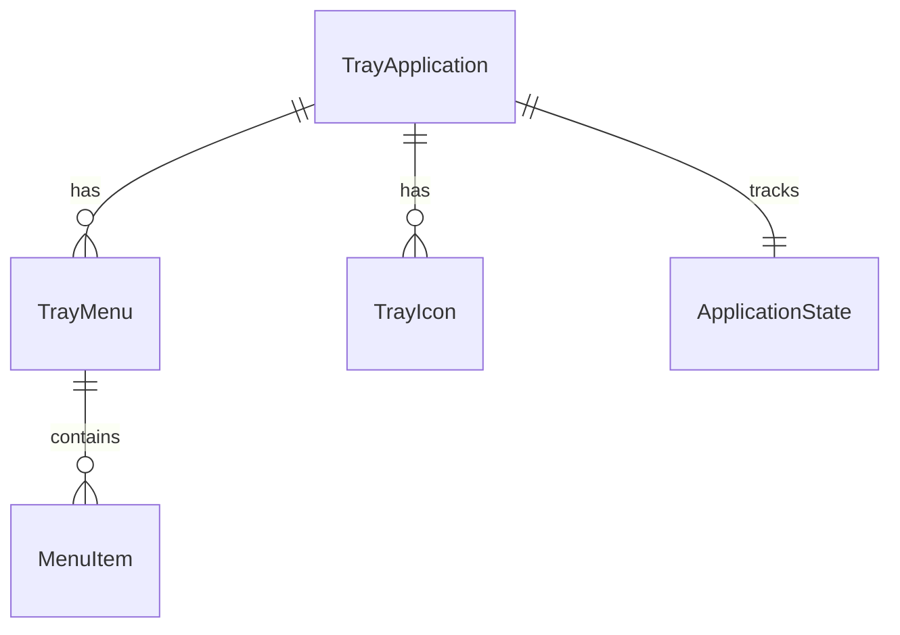
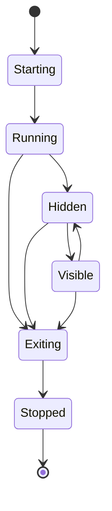

# Data Model: System Tray Background Running

**Date**: 2025-01-25
**Feature**: System Tray Background Running

## Entity Overview

本功能主要涉及系统托盘管理的相关实体，与现有的Microsoft Todo集成功能协同工作。

## Core Entities

### 1. TrayApplication

托盘应用程序的主要配置和状态管理实体。

```go
type TrayApplication struct {
    ID          string    `json:"id"`
    Name        string    `json:"name"`
    Version     string    `json:"version"`
    IconPath    string    `json:"icon_path"`
    Tooltip     string    `json:"tooltip"`
    StartHidden bool      `json:"start_hidden"`
    CreatedAt   time.Time `json:"created_at"`
    UpdatedAt   time.Time `json:"updated_at"`
}
```

**字段说明**:
- `ID`: 应用程序唯一标识符
- `Name`: 应用程序显示名称
- `Version`: 应用程序版本
- `IconPath`: 托盘图标文件路径
- `Tooltip`: 鼠标悬停时显示的提示文本
- `StartHidden`: 是否启动时隐藏主窗口

**验证规则**:
- `Name`: 必填，长度1-50字符
- `IconPath`: 必填，必须是有效的图片文件路径
- `Tooltip`: 可选，最大长度100字符
- `StartHidden`: 必填，布尔值

### 2. TrayMenu

系统托盘右键菜单配置。

```go
type TrayMenu struct {
    ID       string        `json:"id"`
    AppID    string        `json:"app_id"`
    Items    []MenuItem    `json:"items"`
    IsActive bool          `json:"is_active"`
    CreatedAt time.Time    `json:"created_at"`
    UpdatedAt time.Time    `json:"updated_at"`
}
```

**字段说明**:
- `ID`: 菜单唯一标识符
- `AppID`: 关联的应用程序ID
- `Items`: 菜单项列表
- `IsActive`: 菜单是否激活

### 3. MenuItem

托盘菜单项定义。

```go
type MenuItem struct {
    ID          string      `json:"id"`
    Label       string      `json:"label"`
    Tooltip     string      `json:"tooltip,omitempty"`
    Type        MenuType    `json:"type"`
    Action      string      `json:"action,omitempty"`
    Shortcut    string      `json:"shortcut,omitempty"`
    IsSeparator bool        `json:"is_separator"`
    IsEnabled   bool        `json:"is_enabled"`
    Order       int         `json:"order"`
}
```

**字段说明**:
- `ID`: 菜单项唯一标识符
- `Label`: 显示文本
- `Tooltip`: 鼠标悬停提示（可选）
- `Type`: 菜单项类型
- `Action`: 点击时执行的动作
- `Shortcut`: 快捷键（可选）
- `IsSeparator`: 是否为分隔符
- `IsEnabled`: 是否启用
- `Order`: 显示顺序

**MenuType 枚举**:
```go
type MenuType string

const (
    MenuTypeAction   MenuType = "action"   // 执行动作
    MenuTypeSubmenu  MenuType = "submenu"  // 子菜单
    MenuTypeSeparator MenuType = "separator" // 分隔符
)
```

### 4. TrayIcon

托盘图标管理。

```go
type TrayIcon struct {
    ID         string    `json:"id"`
    AppID      string    `json:"app_id"`
    Size       int       `json:"size"`
    FilePath   string    `json:"file_path"`
    Format     string    `json:"format"`
    IsActive   bool      `json:"is_active"`
    CreatedAt  time.Time `json:"created_at"`
    UpdatedAt  time.Time `json:"updated_at"`
}
```

**字段说明**:
- `ID`: 图标唯一标识符
- `AppID`: 关联的应用程序ID
- `Size`: 图标尺寸（像素）
- `FilePath`: 图标文件路径
- `Format`: 图标格式（PNG, ICO等）
- `IsActive`: 是否为当前激活的图标

### 5. ApplicationState

应用程序运行时状态。

```go
type ApplicationState struct {
    AppID         string    `json:"app_id"`
    IsRunning     bool      `json:"is_running"`
    IsVisible     bool      `json:"is_visible"`
    LastActivity  time.Time `json:"last_activity"`
    ProcessID     int       `json:"process_id,omitempty"`
    MemoryUsage   int64     `json:"memory_usage,omitempty"`
    CPUUsage      float64   `json:"cpu_usage,omitempty"`
    StartUpTime   time.Time `json:"start_up_time"`
}
```

**字段说明**:
- `AppID`: 应用程序ID
- `IsRunning`: 是否正在运行
- `IsVisible`: 主窗口是否可见
- `LastActivity`: 最后活动时间
- `ProcessID`: 进程ID（运行时）
- `MemoryUsage`: 内存使用量（字节）
- `CPUUsage`: CPU使用率（百分比）
- `StartUpTime`: 启动时间

## Entity Relationships



**关系说明**:
- 一个`TrayApplication`可以有多个`TrayMenu`
- 一个`TrayApplication`可以有多个`TrayIcon`（不同尺寸）
- 一个`TrayMenu`包含多个`MenuItem`
- 一个`TrayApplication`对应一个`ApplicationState`

## Data Validation Rules

### TrayApplication Validation
```go
func (ta *TrayApplication) Validate() error {
    if ta.Name == "" {
        return errors.New("应用名称不能为空")
    }
    if len(ta.Name) > 50 {
        return errors.New("应用名称不能超过50个字符")
    }
    if ta.IconPath == "" {
        return errors.New("图标路径不能为空")
    }
    if !fileExists(ta.IconPath) {
        return errors.New("图标文件不存在")
    }
    return nil
}
```

### MenuItem Validation
```go
func (mi *MenuItem) Validate() error {
    if mi.Label == "" && !mi.IsSeparator {
        return errors.New("菜单项标签不能为空")
    }
    if mi.Order < 0 {
        return errors.New("菜单项顺序不能为负数")
    }
    return nil
}
```

## Default Configuration

基于功能规范的要求，以下是默认配置：

### Default TrayApplication
```json
{
  "id": "to_icalendar_tray",
  "name": "to_icalendar",
  "version": "1.0.0",
  "icon_path": "assets/icons/tray-32.png",
  "tooltip": "to_icalendar - 任务提醒工具",
  "start_hidden": true
}
```

### Default TrayMenu
```json
{
  "id": "main_menu",
  "app_id": "to_icalendar_tray",
  "is_active": true,
  "items": [
    {
      "id": "exit",
      "label": "退出",
      "tooltip": "退出应用程序",
      "type": "action",
      "action": "quit",
      "is_separator": false,
      "is_enabled": true,
      "order": 1
    }
  ]
}
```

### Default TrayIcon
```json
{
  "id": "tray_icon_32",
  "app_id": "to_icalendar_tray",
  "size": 32,
  "file_path": "assets/icons/tray-32.png",
  "format": "PNG",
  "is_active": true
}
```

## State Management

### Application Lifecycle States

```go
type AppState string

const (
    StateStarting   AppState = "starting"   // 启动中
    StateRunning    AppState = "running"    // 运行中
    StateHidden     AppState = "hidden"     // 隐藏到托盘
    StateVisible    AppState = "visible"    // 主窗口可见
    StateExiting    AppState = "exiting"    // 退出中
    StateStopped    AppState = "stopped"    // 已停止
)
```

### State Transitions



## Integration with Existing Data Models

### 与现有Microsoft Todo功能集成

本功能与现有的`internal/models`中的实体关系：

- **ConfigManager**: 扩展以支持托盘配置
- **Reminder**: 保持不变，托盘功能不影响核心业务逻辑
- **TodoClient**: 保持不变，托盘功能不影响API集成

### 扩展现有Config结构

```go
// 扩展现有的配置结构
type SystemTrayConfig struct {
    Enabled    bool   `yaml:"enabled"`
    IconPath   string `yaml:"icon_path"`
    StartHidden bool  `yaml:"start_hidden"`
    Tooltip    string `yaml:"tooltip"`
}
```

## Performance Considerations

### Memory Usage Targets
- `TrayApplication`: <1KB
- `TrayMenu`: <100B per menu
- `MenuItem`: <50B per item
- `ApplicationState`: <200B

### Update Frequency
- `ApplicationState`: 每30秒更新一次
- 配置数据: 仅在启动和配置变更时更新

## Security Considerations

### Input Validation
- 所有文件路径必须验证在允许的目录范围内
- 菜单标签和提示文本必须过滤特殊字符
- 图标文件必须验证为有效的图片格式

### Resource Access
- 图标文件仅从应用程序目录读取
- 配置文件权限限制为用户读写
- 不允许执行外部程序（除了退出操作）